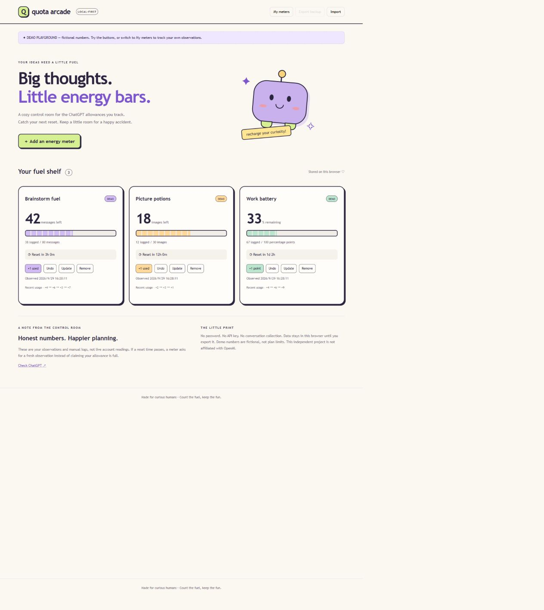

# Quota Arcade ✦

**A playful, local-first ChatGPT allowance journal.** Little energy bars, a friendly robot, and an honest answer when your numbers are out of date.



## What it does

- Create meters for messages, images, credits, or percentage points.
- Record a baseline observation and the next reset time from your account.
- Log usage, undo the last event, and see remaining **estimates**.
- Turn expired observations into **unknown**, rather than inventing a fresh allowance.
- Keep personal data in localStorage, separate from a clearly labeled fictional demo.
- Import validated JSON backups and export your personal meters.

**This version does not automatically read your ChatGPT account.** It uses no credentials, private endpoints, chat scraping, or API calls. Demo values are invented examples, not subscription entitlements. ChatGPT, Codex/Work and API usage should not be treated as interchangeable allowances.

## Run

Requires Node.js 22 or later. No dependency installation needed.

```sh
npm start
# Open http://127.0.0.1:3202
npm test
```

For static hosting, deploy the `public/` directory. The included Pages workflow can be run manually after configuring GitHub Pages to use GitHub Actions.

## Two-minute demo

1. In demo mode, log one unit and undo it.
2. Switch to **My meters** and create a meter using your own observed values.
3. Reload: the personal meter persists.
4. Export a backup. Update the observation to start a fresh measurement window.
5. Explain why an elapsed countdown means “check your account,” not “quota restored.”

## Engineering decisions

The framework-free interface keeps the data model small and testable. `public/core.js` owns validation, immutable updates, usage arithmetic, reset boundaries and demo fixtures. `public/app.js` owns DOM rendering and storage. The Node server is a local development utility; production can be entirely static.

A meter is a baseline observation plus positive usage events. Unknown reset behavior is explicit. The schema rejects non-finite values, duplicate IDs, invalid units and events outside the observation window. User labels are rendered with `textContent` rather than HTML.

## Limits and tradeoffs

- Manual recording can miss activity from other devices or products. This is a journal, not an authoritative billing tool.
- Only a single next-reset timestamp is modeled. Rolling windows and shared entitlement groups are not inferred.
- Updating an observation replaces its previous events; export first to preserve them.
- localStorage is browser-specific. No encryption, cloud sync or multi-tab transaction locking is provided. Simultaneous edits in multiple tabs can overwrite one another.
- Backups are limited to 2 MB, 50 meters and 10,000 events per meter.
- There is no automatic notification service while the page is closed.

Official context checked September 2026: [ChatGPT/Codex pricing and usage](https://learn.chatgpt.com/docs/pricing), [account usage controls](https://developers.openai.com/siwc/token-sharing-open-source/profiles-and-sessions). These references do not establish a public personal-chat quota API for this project.

## 中文说明

一个像游戏补给站的 ChatGPT 额度记录器：手动记录账户显示的额度和重置时间，支持倒计时、撤销与备份。数字来自你的记录，不代表自动同步的官方实时额度。示例数据与个人数据分开保存。

可用于展示：状态建模、输入校验、数据持久化、异常处理、可访问性及有个性的界面设计。项目由 AI 辅助开发；使用者应运行、理解并继续完善代码，再在面试中讲解自己的实现与取舍。

License: MIT. Independent project, not affiliated with OpenAI.
